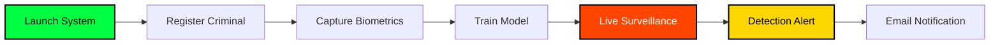

<div align="center">

# 🎯 VISIO-NEXUS AI Surveillance System


[](https://www.python.org/)
[](https://opencv.org/)
[](LICENSE)
[](https://github.com/koushik4475/visionexus/stargazers)

**🌐 [Live Demo](https://visionexus.netlify.app) | 📖 [Documentation](https://visionexusdev.netlify.app) | 💼 [Portfolio](https://koushikhy.netlify.app)**

---

### 🎬 *"Your mission, should you choose to accept it..."*

An advanced AI-powered facial recognition surveillance system inspired by the cutting-edge technology from **Mission: Impossible - Dead Reckoning**. This system delivers real-time criminal detection with an authentic cinematic IMF interface.

</div>

---

## 🌟 Key Features

<table>
<tr>
<td width="50%">

### 🎯 Intelligence Suite
- 🔍 **Real-Time Recognition** - Live camera surveillance with instant identification
- 🗄️ **IMF Database** - Comprehensive criminal intelligence profiles
- 📊 **Confidence Scoring** - Advanced accuracy metrics
- 🔊 **Voice Alerts** - Text-to-speech announcements
- 📧 **Email Briefings** - Automated mission reports

</td>
<td width="50%">

### 🎨 Interface Excellence
- 🎬 **Cinematic UI** - Mission: Impossible themed design
- ⚡ **Particle Effects** - Dynamic animated backgrounds
- 🌌 **Matrix Animations** - Cascading digital effects
- 📡 **Radar Scanning** - Advanced HUD elements
- 🔐 **Classified Styling** - Top-secret aesthetics

</td>
</tr>
</table>

---

## 📸 Visual System Overview

<div align="center">

### 🏠 Mission Control Dashboard
*IMF-style command center with real-time monitoring*

<details open>
<summary><b>👁️ View Interface</b></summary>
<br>


**Features:**
- 🎨 Animated particle background with connecting lines
- 📊 Real-time system status indicators
- ⚡ Quick access to all surveillance modules
- 📈 Performance monitoring panels
</details>

---

### 🎯 Criminal Registration Portal
*Biometric acquisition with classified database integration*

<details>
<summary><b>👁️ View Interface</b></summary>
<br>


**Capabilities:**
- 📝 Comprehensive criminal profile forms
- 📷 Biometric data capture (30+ facial samples)
- 💾 Support for camera and file-based input
- ⌨️ Mission briefing with typewriter effects
- 🌊 Matrix effects & scanning radar animations
</details>

---

### 🔍 Visio-Lens Analysis System
*Advanced photo analysis with confidence scoring*

<details>
<summary><b>👁️ View Interface</b></summary>
<br>


**Features:**
- 📤 Upload and analyze individual photos
- 🎯 Real-time face recognition with percentages
- 📋 Detailed criminal profile viewer
- 🔊 Text-to-speech announcements
- 🌑 Modern dark UI with professional styling
</details>

---

### 📹 Live Surveillance Monitor
*Real-time camera tracking with instant alerts*

<details>
<summary><b>👁️ View Interface</b></summary>
<br>


**Live Monitoring:**
- 🎥 Real-time face detection and recognition
- ⚡ Instant criminal identification overlays
- 🚀 Multi-threading for optimal performance
- 📊 Live detection results with confidence scores
</details>

---

### 📧 Email Alert System
*Professional notifications with evidence capture*

<details>
<summary><b>👁️ View Interface</b></summary>
<br>


**Alert Features:**
- 📨 HTML-formatted professional emails
- 📸 Captured criminal photos attached
- 📍 Location with Google Maps integration
- ⏰ Timestamp and detection confidence data
- ⚠️ Automatic threat level assessment
</details>

---

### 🗄️ Database Management
*SQLite intelligence database with profile viewer*

<details>
<summary><b>👁️ View Interface</b></summary>
<br>


**Management:**
- 💾 Complete criminal profile storage
- 🔍 Search and filter capabilities
- 📊 Biometric data organization
- 📤 Export functionality for reports
</details>

---

### 📁 Project Structure
*Organized architecture for optimal performance*

<details>
<summary><b>👁️ View Structure</b></summary>
<br>

</details>

---

### 🗃️ Database Schema
*Efficient SQLite data architecture*

<details>
<summary><b>👁️ View Schema</b></summary>
<br>

</details>

---

### 📂 File Organization
*Clean and maintainable structure*

<details>
<summary><b>👁️ View Files</b></summary>
<br>

</details>

</div>

---

## 🚀 Quick Start

### 📋 Prerequisites

```bash
Python 3.7+
Webcam/Camera device
4GB+ RAM (8GB recommended)
Multi-core processor
```

### ⚙️ Installation

```bash
# Clone the repository
git clone https://github.com/koushik4475/visionexus.git
cd visionexus

# Install dependencies
pip install -r requirements.txt

# Create required directories
mkdir dataSet recognizer temp detected_criminals screenshots docs
```

### 🔧 Configuration

**Email Setup (Optional):**
```python
# Edit visio-live.py
self.sender_email = "your-email@gmail.com"
self.sender_password = "your-app-password"
self.receiver_email = "recipient@gmail.com"
```

### ▶️ Launch

```bash
python home.py
```

---

## 💻 Core Dependencies

<div align="center">

| Package | Version | Purpose |
|---------|---------|---------|
| opencv-python | Latest | Computer Vision |
| opencv-contrib-python | Latest | Extended CV Modules |
| face-recognition | Latest | Face Detection & Recognition |
| Pillow | Latest | Image Processing |
| numpy | Latest | Numerical Operations |
| tkinter | Built-in | GUI Framework |
| sqlite3 | Built-in | Database Management |
| gtts | Latest | Text-to-Speech |
| pyttsx3 | Latest | Voice Engine |
| psutil | Latest | System Monitoring |

</div>

---

## 🎯 Usage Workflow



### 📝 Step-by-Step Guide

<table>
<tr>
<td width="33%">

#### 1️⃣ Registration
- Launch main interface
- Click "Register Criminal"
- Fill profile information
- Capture/upload photos
- Complete biometric training

</td>
<td width="33%">

#### 2️⃣ Surveillance
- Click "Live Surveillance"
- System loads known faces
- Real-time detection begins
- Instant alerts triggered
- Evidence captured

</td>
<td width="33%">

#### 3️⃣ Analysis
- Click "Visio-Lens"
- Upload photos
- View confidence scores
- Access detailed profiles
- Export reports

</td>
</tr>
</table>

---

## 🏗️ Technical Architecture

<div align="center">

### 🧠 Face Recognition Pipeline

```
┌─────────────┐    ┌──────────────┐    ┌─────────────┐    ┌──────────────┐
│   Image     │───▶│     Face     │───▶│   Feature   │───▶│ Confidence   │
│Preprocessing│    │  Detection   │    │ Extraction  │    │   Scoring    │
└─────────────┘    └──────────────┘    └─────────────┘    └──────────────┘
      │                    │                    │                   │
      ▼                    ▼                    ▼                   ▼
 Normalization      HOG Algorithm      128-D Encodings    Threshold Match
```

### ⚡ Performance Optimizations

| Feature | Technology | Benefit |
|---------|-----------|---------|
| 🔄 Multi-threading | Python Threading | UI Responsiveness |
| ⚙️ Multiprocessing | Python Multiprocessing | Parallel Face Recognition |
| 🎞️ Frame Skipping | OpenCV | Real-time Performance |
| 💾 Caching | In-memory Storage | Faster Lookups |
| 🧹 Memory Management | Garbage Collection | Resource Efficiency |

</div>

---

## 🎨 Mission: Impossible Theme

<div align="center">

### 🎬 Authentic IMF Design Elements

<table>
<tr>
<td align="center" width="33%">

<br><b>Classified Interface</b>
<br>Top-secret styling
</td>
<td align="center" width="33%">

<br><b>Cinematic Animations</b>
<br>Matrix & radar effects
</td>
<td align="center" width="33%">

<br><b>Mission Briefings</b>
<br>Self-destructing messages
</td>
</tr>
<tr>
<td align="center" width="33%">

<br><b>Biometric Acquisition</b>
<br>Professional scanning
</td>
<td align="center" width="33%">

<br><b>Agent Authentication</b>
<br>Secure access controls
</td>
<td align="center" width="33%">

<br><b>IMF Database</b>
<br>Classified intelligence
</td>
</tr>
</table>

</div>

---

## 🔒 Security & Privacy

<div align="center">

| Feature | Implementation |
|---------|---------------|
| 🔐 **Database Encryption** | Secure SQLite storage |
| 🛡️ **Access Control** | Authentication mechanisms |
| 📝 **Audit Trail** | Complete activity logging |
| ✅ **Data Integrity** | Validation protocols |
| 🗑️ **Secure Deletion** | GDPR compliance ready |

</div>

> **⚠️ Legal Notice:** This system is for educational and research purposes. Users must comply with local privacy laws (GDPR, CCPA), obtain necessary consents, and ensure ethical use of biometric data.

---

## 🛠️ Troubleshooting

<details>
<summary><b>📷 Camera Access Error</b></summary>

- Check camera permissions in system settings
- Ensure no other applications are using the camera
- Try different camera indices (0, 1, 2) in code
- Verify camera drivers are installed
</details>

<details>
<summary><b>🎯 Low Recognition Accuracy</b></summary>

- Increase training images (minimum 20-30 per person)
- Ensure good lighting during capture
- Use high-quality, clear images
- Verify face is properly framed
- Retrain model with better samples
</details>

<details>
<summary><b>⚡ Performance Issues</b></summary>

- Adjust frame skip settings in code
- Close unnecessary background applications
- Increase available RAM
- Consider GPU acceleration
- Optimize detection thresholds
</details>

---

## 🤝 Contributing

We welcome contributions! Here's how you can help:

1. 🍴 Fork the repository
2. 🌿 Create a feature branch (`git checkout -b feature/AmazingFeature`)
3. 💾 Commit your changes (`git commit -m 'Add AmazingFeature'`)
4. 📤 Push to the branch (`git push origin feature/AmazingFeature`)
5. 🔀 Open a Pull Request

---

## 👨‍💻 Developer

<div align="center">


### KOUSHIK HY
**Full-Stack Developer | AI/ML Enthusiast**

🎓 Computer Science & Design | Mysore University School of Engineering  
📍 Karnataka, India | 570012

[](https://koushikhy.netlify.app)
[](mailto:koushik4475@gmail.com)
[](https://visionexus.netlify.app)

---

### 💼 Expertise

```python
skills = {
    'Full_Stack': ['WebApps', 'Websites', 'Clones'],
    'AI_ML': ['Computer Vision', 'Face Recognition', 'Real-time Processing'],
    'Backend': ['Python', 'Database Management', 'API Development'],
    'Frontend': ['GUI Frameworks', 'Responsive Design', 'UI/UX']
}
```

*"Working for myself to improve my skills"* - Building innovative solutions through continuous learning

</div>

---

## 📊 Project Stats

<div align="center">


</div>

---

## 🙏 Acknowledgments

<div align="center">

| Technology | Credit |
|------------|--------|
| 🎯 **OpenCV** | Computer vision foundation |
| 👤 **face_recognition** | Adam Geitgey's library |
| 🖼️ **Tkinter** | GUI framework |
| 🗄️ **SQLite** | Database management |
| 🎬 **Mission: Impossible** | Design inspiration |

</div>

---

## 📜 License

<div align="center">

This project is licensed under the **MIT License** - see the [LICENSE](LICENSE) file for details.

```
MIT License - Free to use, modify, and distribute
Educational and research purposes
Users responsible for legal compliance
```

</div>

---

## 📈 Version History

<table>
<tr>
<th>Version</th>
<th>Release Date</th>
<th>Highlights</th>
</tr>
<tr>
<td><b>v2.2.0</b></td>
<td>Latest</td>
<td>✨ Enhanced UI, Performance optimizations, Email alerts</td>
</tr>
<tr>
<td><b>v2.1.0</b></td>
<td>2024</td>
<td>🚀 Multi-threading support, Improved accuracy</td>
</tr>
<tr>
<td><b>v2.0.0</b></td>
<td>2024</td>
<td>🎨 Complete system redesign, Modern interface</td>
</tr>
<tr>
<td><b>v1.0.0</b></td>
<td>2023</td>
<td>🎉 Initial release</td>
</tr>
</table>

---

<div align="center">

### 🌟 Star History

[](https://star-history.com/#koushik4475/visionexus&Date)

---

### 💫 Show Your Support

If you find this project useful, please consider giving it a ⭐!

**Made with ❤️ and Mission: Impossible inspiration**


---

**📞 Support & Contact**

For issues, questions, or contributions:
- 📝 [Create an issue](https://github.com/koushik4475/visionexus/issues)
- 📖 [Check documentation](https://visionexusdev.netlify.app)
- 📧 [Email developer](mailto:koushik4475@gmail.com)

---

**⚠️ Disclaimer**

This software is provided for educational purposes only. Users are responsible for ensuring ethical and legal use in compliance with applicable laws and regulations regarding surveillance, privacy, and biometric data collection.

---

© 2024 KOUSHIK HY. All Rights Reserved.

</div>
