<div align="center">

# 🎯 VISIO-NEXUS


### Advanced AI Surveillance | Mission: Impossible Inspired

<!-- Badges -->
<p align="center">
  
  
  
  
</p>

<p align="center">
  
  
  
  
</p>

<!-- Navigation -->
<p align="center">
  <a href="#-features">Features</a> •
  <a href="#-visual-system">Visual System</a> •
  <a href="#-installation">Installation</a> •
  <a href="#-usage">Usage</a> •
  <a href="#-tech-stack">Tech Stack</a> •
  <a href="#-developer">Developer</a>
</p>

<!-- Animated Divider -->


</div>

---

## ⚠️ Legal Disclaimer

<div align="center">

### 📋 Important Legal Information

**⚖️ Usage Terms**
- Educational & research purposes only
- Not for commercial surveillance
- Users responsible for legal compliance
- Must obtain necessary consents
- Follow local privacy regulations

**🛡️ Privacy Compliance**
- GDPR compliance required
- CCPA compliance required
- Biometric data consent needed
- Data retention policies apply
- Right to deletion must be honored

> **⚠️ Warning:** This software handles sensitive biometric data. Users must ensure ethical use and compliance with all applicable laws including data protection regulations, surveillance laws, and privacy requirements in their jurisdiction.


</div>

---

<div align="center">

## 💫 Show Your Support


<br>

### If you found this project helpful, please consider:

<br>

<table>
<tr>
<td align="center" width="33%">
<br>
<a href="https://github.com/koushik4475/visionexus/stargazers">

</a>
<br><br>
<b>Give us a star</b>
<br>
Show your appreciation
<br><br>
</td>
<td align="center" width="33%">
<br>
<a href="https://github.com/koushik4475/visionexus/fork">

</a>
<br><br>
<b>Fork the project</b>
<br>
Create your own version
<br><br>
</td>
<td align="center" width="33%">
<br>
<a href="https://github.com/koushik4475/visionexus/subscription">

</a>
<br><br>
<b>Watch updates</b>
<br>
Stay informed
<br><br>
</td>
</tr>
</table>

<br>


---

### 🔗 Quick Links

<a href="https://visionexus.netlify.app">Live Demo</a> • 
<a href="https://visionexusdev.netlify.app">Documentation</a> • 
<a href="https://koushikhy.netlify.app">Portfolio</a> • 
<a href="mailto:koushik4475@gmail.com">Contact</a> • 
<a href="https://github.com/koushik4475/visionexus/issues">Report Bug</a> • 
<a href="https://github.com/koushik4475/visionexus/issues">Request Feature</a>

---

**© 2024 KOUSHIK HY • All Rights Reserved • MIT License**

<br>


</div>/115834477-dbab4500-a447-11eb-908a-139a6edaec5c.gif">

### 🎬 *"Your mission, should you choose to accept it..."*

An **advanced AI-powered facial recognition surveillance system** inspired by the cutting-edge technology from **Mission: Impossible - Dead Reckoning**. Experience real-time criminal detection with an authentic cinematic IMF interface.

<p align="center">
  <a href="https://visionexus.netlify.app">
    
  </a>
  <a href="https://visionexusdev.netlify.app">
    
  </a>
  <a href="https://koushikhy.netlify.app">
    
  </a>
</p>


</div>

---

## 🌟 Features

<div align="center">

### 🎯 Intelligence Suite

- 🔍 **Real-Time Recognition** - Live camera surveillance with instant ID
- 🗄️ **IMF Database** - Comprehensive criminal intelligence
- 📊 **Confidence Scoring** - Advanced accuracy metrics
- 🔊 **Voice Alerts** - Text-to-speech announcements
- 📧 **Email Briefings** - Automated mission reports

### 🎨 Interface Excellence

- 🎬 **Cinematic UI** - Mission: Impossible themed design
- ⚡ **Particle Effects** - Dynamic animated backgrounds
- 🌌 **Matrix Animations** - Cascading digital effects
- 📡 **Radar Scanning** - Advanced HUD elements
- 🔐 **Classified Styling** - Top-secret aesthetics


</div>

---

## 📸 Visual System

<div align="center">

### 🏠 Mission Control Dashboard
*IMF-style command center with real-time monitoring*

<details open>
<summary><b>🔥 VIEW INTERFACE</b></summary>
<br>


**Features:** Particle Background • Real-time Status • Quick Access • Performance Monitor

</details>


### 🎯 Criminal Registration Portal
*Biometric acquisition with classified database integration*

<details>
<summary><b>🔥 VIEW INTERFACE</b></summary>
<br>


**Features:** Profile Forms • 30+ Samples • Multi-input Support • Typewriter Effects • Matrix Animations

</details>


### 🔍 Visio-Lens Analysis System
*Advanced photo analysis with confidence scoring inspired by Google Lens*

<details>
<summary><b>🔥 VIEW INTERFACE</b></summary>
<br>


**Features:** Photo Upload • Face Recognition • Profile Viewer • Dark Theme

</details>


### 📹 Live Surveillance Monitor
*Real-time camera tracking with instant alerts*

<details>
<summary><b>🔥 VIEW INTERFACE</b></summary>
<br>


**Features:** Real-time Detection • Instant ID Overlay • Multi-threading • Live Confidence

</details>


### 📧 Email Alert System
*Professional notifications with evidence capture*

<details>
<summary><b>🔥 VIEW INTERFACE</b></summary>
<br>


**Features:** HTML Emails • Photo Attachments • GPS Location • Time Stamps • Threat Levels

</details>


### 🗄️ Database Management
*SQLite intelligence database with profile viewer*

<details>
<summary><b>🔥 VIEW INTERFACE</b></summary>
<br>


**Features:** Profile Storage • Search & Filter • Data Organization • Export Reports

</details>


### 📁 Project Structure
*Organized architecture for optimal performance*

<details>
<summary><b>🔥 VIEW STRUCTURE</b></summary>
<br>


</details>


### 🗃️ Database Schema
*Efficient SQLite data architecture*

<details>
<summary><b>🔥 VIEW SCHEMA</b></summary>
<br>


</details>


### 📂 File Organization
*Clean and maintainable structure*

<details>
<summary><b>🔥 VIEW FILES</b></summary>
<br>


</details>

</div>

<div align="center">

</div>

---

## 🚀 Installation

<div align="center">

### 📋 Prerequisites

```bash
✅ Python 3.7+
✅ Webcam/Camera device
✅ 4GB+ RAM (8GB recommended)
✅ Multi-core processor
```

</div>

### ⚙️ Setup Process

**1. Clone Repository**
```bash
git clone https://github.com/koushik4475/visionexus.git
cd visionexus
```

**2. Install Dependencies**
```bash
pip install -r requirements.txt
```

**3. Create Directories**
```bash
mkdir dataSet recognizer temp detected_criminals
```

### 🔧 Email Configuration (Optional)

```python
# Edit visio-live.py
self.sender_email = "your-email@gmail.com"
self.sender_password = "your-app-password"
self.receiver_email = "recipient@gmail.com"
```

### ▶️ Launch Application

```bash
python home.py
```

<div align="center">

</div>

---

## 💻 Tech Stack

<div align="center">

<table>
<tr>
<td align="center" width="20%">

<br><b>Python</b>
</td>
<td align="center" width="20%">

<br><b>OpenCV</b>
</td>
<td align="center" width="20%">

<br><b>NumPy</b>
</td>
<td align="center" width="20%">

<br><b>SQLite</b>
</td>
<td align="center" width="20%">

<br><b>TensorFlow</b>
</td>
</tr>
</table>

### 📦 Core Dependencies

| Package | Version | Purpose |
|---------|---------|---------|
| 🔵 opencv-python | Latest | Computer Vision |
| 🟣 opencv-contrib-python | Latest | Extended CV Modules |
| 🟢 face-recognition | Latest | Face Detection & Recognition |
| 🔴 Pillow | Latest | Image Processing |
| 🟡 numpy | Latest | Numerical Operations |
| 🟠 tkinter | Built-in | GUI Framework |
| 🔵 sqlite3 | Built-in | Database Management |
| 🟣 gtts | Latest | Text-to-Speech |
| 🟢 pyttsx3 | Latest | Voice Engine |
| 🔴 psutil | Latest | System Monitoring |


</div>

---

## 🎯 Usage

<div align="center">

### 📊 Workflow Diagram

```mermaid
graph LR
    A[🚀 Launch] --> B[📝 Register]
    B --> C[📷 Capture]
    C --> D[🎓 Train]
    D --> E[📹 Surveil]
    E --> F[⚡ Detect]
    F --> G[📧 Alert]
    
    style A fill:#00FF41,stroke:#000,stroke-width:3px,color:#000
    style E fill:#FF4500,stroke:#000,stroke-width:3px,color:#fff
    style F fill:#FFD700,stroke:#000,stroke-width:3px,color:#000
    style G fill:#4169E1,stroke:#000,stroke-width:3px,color:#fff
```



### 📖 Step-by-Step Guide

#### 1️⃣ REGISTRATION
✅ Launch main interface  
✅ Click "Register Criminal"  
✅ Fill profile information  
✅ Capture/upload photos  
✅ Complete training

#### 2️⃣ SURVEILLANCE
✅ Click "Live Surveillance"  
✅ System loads faces  
✅ Real-time detection  
✅ Instant alerts  
✅ Evidence capture

#### 3️⃣ ANALYSIS
✅ Click "Visio-Lens"  
✅ Upload photos  
✅ View confidence scores  
✅ Access profiles  
✅ Export reports


</div>

---

## 🏗️ Architecture

<div align="center">

### 🧠 Face Recognition Pipeline

```
┌─────────────┐    ┌──────────────┐    ┌─────────────┐    ┌──────────────┐
│   Image     │───▶│     Face     │───▶│   Feature   │───▶│ Confidence   │
│Preprocessing│    │  Detection   │    │ Extraction  │    │   Scoring    │
└─────────────┘    └──────────────┘    └─────────────┘    └──────────────┘
      │                    │                    │                   │
      ▼                    ▼                    ▼                   ▼
 Normalization      HOG Algorithm      128-D Encodings    Threshold Match
```

### ⚡ Performance Features

**Multi-threading** - UI Responsiveness  
**Multiprocessing** - Parallel Recognition  
**Frame Skipping** - Real-time Speed  
**Caching** - Faster Lookups  
**GC Management** - Resource Efficiency


</div>

---

## 🎨 Mission: Impossible Theme

<div align="center">

### 🎬 Authentic IMF Design Elements

🔐 **Classified Interface** - Top-secret mission styling  
🎨 **Matrix Effects** - Cascading digital rain  
📡 **Radar Scanning** - HUD tracking systems  
👆 **Biometric Scan** - Professional acquisition  
🔒 **Authentication** - Secure access control  
🗄️ **IMF Database** - Intelligence archives


</div>

---

## 🔒 Security

<div align="center">

| Feature | Implementation | Status |
|---------|---------------|--------|
| 🔐 **Database Encryption** | Secure SQLite storage | ✅ Active |
| 🛡️ **Access Control** | Authentication system | ✅ Active |
| 📝 **Audit Trail** | Activity logging | ✅ Active |
| ✅ **Data Integrity** | Validation protocols | ✅ Active |
| 🗑️ **Secure Deletion** | GDPR compliance | ✅ Active |

> **⚠️ Legal Notice:** Educational & research use only. Comply with GDPR, CCPA, and local privacy laws. Obtain necessary consents for biometric data.


</div>

---

## 🛠️ Troubleshooting

<details>
<summary><b>📷 Camera Access Error</b></summary>

- ✅ Check system camera permissions
- ✅ Close other camera applications
- ✅ Try different camera indices (0, 1, 2)
- ✅ Update camera drivers
- ✅ Restart application

</details>

<details>
<summary><b>🎯 Low Recognition Accuracy</b></summary>

- ✅ Increase training images (20-30+ per person)
- ✅ Ensure proper lighting conditions
- ✅ Use high-quality, clear images
- ✅ Verify face is properly framed
- ✅ Retrain with better samples

</details>

<details>
<summary><b>⚡ Performance Issues</b></summary>

- ✅ Adjust frame skip settings
- ✅ Close background applications
- ✅ Increase available RAM
- ✅ Enable GPU acceleration
- ✅ Optimize detection thresholds

</details>

<div align="center">

</div>

---

## 👨‍💻 Developer

<div align="center">


<br>

[](https://koushikhy.netlify.app)
[](mailto:koushik4475@gmail.com)
[](https://visionexus.netlify.app)

<br>

### 💼 Technical Expertise

```python
expertise = {
    'Full_Stack': ['WebApps', 'Websites', 'Full-Stack Clones'],
    'AI_ML': ['Computer Vision', 'Face Recognition', 'Real-time Processing'],
    'Backend': ['Python', 'Database Management', 'API Development'],
    'Frontend': ['GUI Frameworks', 'Responsive Design', 'Cinematic UI/UX']
}
```

<br>

> *"Working for myself to improve my skills"*  
> *Building innovative solutions through continuous learning*


</div>

---

## 📊 GitHub Stats

<div align="center">

<table>
<tr>
<td width="50%">

</td>
<td width="50%">

</td>
</tr>
</table>


### 🌟 Repository Stats


</div>

---

## 🤝 Contributing

<div align="center">

### We Love Contributions!

**Help us make VISIO-NEXUS even better!**

</div>

### 📝 Contribution Guidelines

**1. Fork** - Fork the repo  
**2. Branch** - Create feature branch  
**3. Code** - Make changes  
**4. Test** - Add tests  
**5. Submit** - Pull request

### 💻 Quick Start

```bash
# Fork and clone
git clone https://github.com/YOUR_USERNAME/visionexus.git
cd visionexus

# Create feature branch
git checkout -b feature/AmazingFeature

# Make changes and commit
git add .
git commit -m "✨ Add AmazingFeature"

# Push to branch
git push origin feature/AmazingFeature

# Open Pull Request on GitHub
```

<div align="center">

</div>

---

## 🙏 Acknowledgments

<div align="center">

### Built With Amazing Technologies

<table>
<tr>
<td align="center" width="20%">

<br><b>OpenCV</b>
<br>Computer vision foundation
</td>
<td align="center" width="20%">

<br><b>SQLite</b>
<br>Database management
</td>
<td align="center" width="20%">

<br><b>face_recognition</b>
<br>By Adam Geitgey
</td>
<td align="center" width="20%">

<br><b>Tkinter</b>
<br>GUI framework
</td>
<td align="center" width="20%">
<br><b>MI Franchise</b>
<br>Design inspiration
</td>
</tr>
</table>

### 🌟 Special Thanks

> **Mission: Impossible - Dead Reckoning** for the incredible cinematic inspiration  
> **Open Source Community** for amazing tools and libraries  
> **Contributors** who help make this project better


</div>

---

## 📜 License

<div align="center">


### MIT License

```
Copyright (c) 2024 KOUSHIK HY

Permission is hereby granted, free of charge, to any person obtaining a copy
of this software and associated documentation files (the "Software"), to deal
in the Software without restriction, including without limitation the rights
to use, copy, modify, merge, publish, distribute, sublicense, and/or sell
copies of the Software, and to permit persons to whom the Software is
furnished to do so, subject to the following conditions:

The above copyright notice and this permission notice shall be included in all
copies or substantial portions of the Software.

THE SOFTWARE IS PROVIDED "AS IS", WITHOUT WARRANTY OF ANY KIND, EXPRESS OR
IMPLIED, INCLUDING BUT NOT LIMITED TO THE WARRANTIES OF MERCHANTABILITY,
FITNESS FOR A PARTICULAR PURPOSE AND NONINFRINGEMENT.
```

**Free to use • Modify • Distribute**


</div>

---

## 📈 Version History

<div align="center">

<table>
<tr>
<th width="15%">Version</th>
<th width="20%">Date</th>
<th width="65%">Highlights</th>
</tr>
<tr>
<td align="center"><b>v2.2.0</b><br>🎉</td>
<td align="center">Latest<br>2024</td>
<td>
✨ Enhanced Mission: Impossible UI<br>
⚡ Performance optimizations with multi-threading<br>
📧 Email alert system with attachments<br>
🎨 Advanced animations (Matrix, radar, particles)<br>
📊 Real-time confidence scoring
</td>
</tr>
<tr>
<td align="center"><b>v2.1.0</b><br>🚀</td>
<td align="center">Q3 2024</td>
<td>
🔄 Multi-threading support for UI responsiveness<br>
🎯 Improved recognition accuracy<br>
💾 Database optimization<br>
🔊 Voice announcement system
</td>
</tr>
<tr>
<td align="center"><b>v2.0.0</b><br>🎨</td>
<td align="center">Q2 2024</td>
<td>
🎬 Complete system redesign<br>
🌑 Modern dark theme interface<br>
📸 Visio-Lens photo analysis<br>
🗄️ Comprehensive database viewer
</td>
</tr>
<tr>
<td align="center"><b>v1.0.0</b><br>🎊</td>
<td align="center">Q1 2023</td>
<td>
🎉 Initial release<br>
👤 Basic face recognition<br>
📹 Live surveillance system<br>
🗄️ SQLite database integration
</td>
</tr>
</table>


</div>

---

## 📞 Support

<div align="center">

### 🆘 Need Help?

<a href="https://github.com/koushik4475/visionexus/issues">

</a>
<a href="https://visionexusdev.netlify.app">

</a>
<a href="mailto:koushik4475@gmail.com">

</a>

**Report bugs or request features** • **Check comprehensive guides** • **Direct developer contact**

